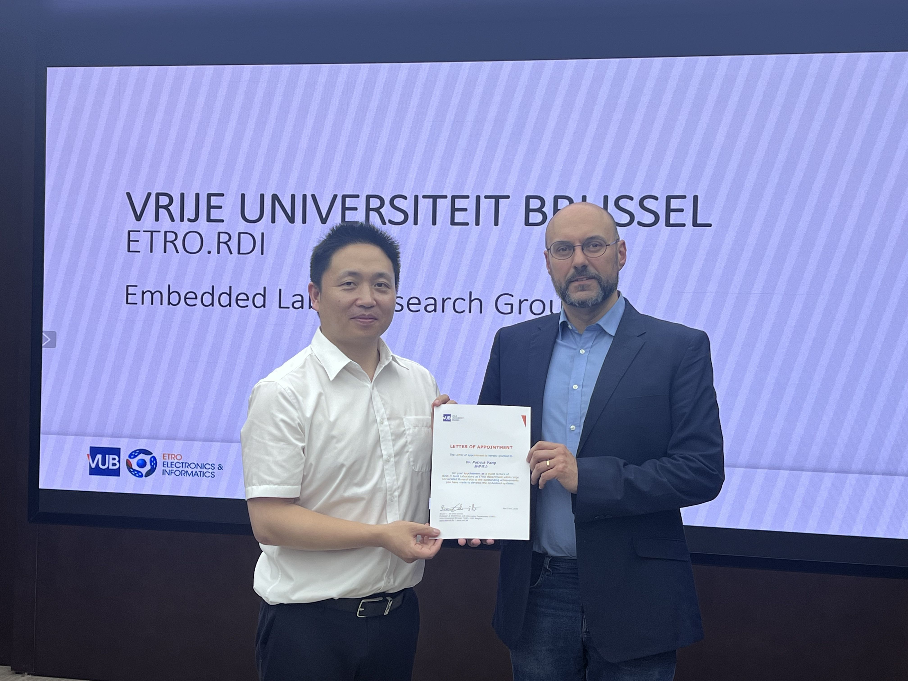

Bruno da Silva visited the WCH headquarters at the invitation of Dr. Yong Yang, CTO of WCH. During the visit, Dr. Yong Yang introduced WCH's history, current development, and main product lines, and presented a series of demonstrations showcasing the company's embedded and RISC-V technologies.

The visit also provided an opportunity for both sides to exchange updates on the course development progress for the WCH-ETRO Joint RISC-V Laboratory. The discussion focused on how to connect WCH's industrial platforms and technical expertise with ETRO's education and research activities in embedded systems.

At the end of the visit, Bruno da Silva appointed Dr. Yong Yang as a guest lecturer of VUB ETRO, further strengthening the collaboration between WCH and ETRO in RISC-V education and applied embedded-system innovation.

